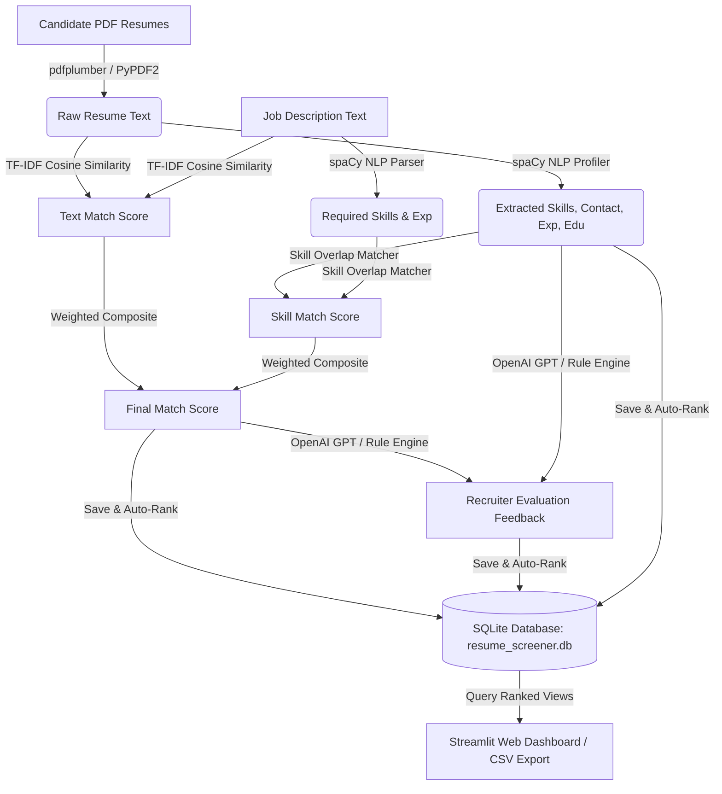

# TalentRank | AI-Powered Resume Screening & Ranking System 💼🤖

TalentRank is a high-performance Python-based resume screening and candidate ranking system. It is designed to parse, analyze, score, persist, and rank candidate resumes against detailed job descriptions using Natural Language Processing (NLP) and vector similarity.

The system features both a **headless backend library** (`src/`) and an **interactive, premium Streamlit dashboard** (`app.py`) with analytics, candidate metrics, and ranking tables.

---

## 🌟 Key Features

*   **PDF Extraction**: Safe, multi-layered text extraction from candidate PDF resumes (using `pdfplumber` with a fallback to `PyPDF2`).
*   **NLP Skill Profiling**: Auto-extraction of technical/soft skills from resumes and job descriptions using custom `spaCy` PhraseMatchers and a predefined catalog of 100+ skills.
*   **Composite Scoring Engine**:
    *   **TF-IDF Cosine Similarity**: Evaluates textual similarity between the candidate resume and the job description.
    *   **Skill Overlap Score**: Measures exact matches and gaps against required job skills.
    *   **Custom Weighting**: Allows adjustability of TF-IDF vs. Skill Match weights dynamically.
*   **AI-Powered Recruiter Feedback**: Generates 2-3 sentence recruiter feedback summaries. Integrates with the **OpenAI API** (`gpt-4o-mini`) when configured, with a robust rule-based template engine fallback when no API key is present.
*   **SQLite Persistence**: Stores job postings and candidate screening profiles persistently, sorting candidates automatically by final scores.
*   **Rich Interactive Dashboard**: An elegant Streamlit interface featuring summary cards, score visualizers, adjustable parameter sliders, and detailed candidate report expanders.

---

## 📐 System Architecture

The following diagram shows the end-to-end data pipeline from PDF upload to database persistence and ranking:



---

## 📂 Project Layout

```
AI-Powered-Resume-Screening-System/
├── .gitignore                   # Excludes env files, databases, and caches
├── README.md                    # Root project documentation (this file)
└── resume_screening_system/
    ├── requirements.txt         # Package dependencies
    ├── .env.example             # Template for API configuration
    ├── README.md                # Subfolder developer guide
    ├── app.py                   # Streamlit Dashboard entry point
    ├── run_pipeline_demo.py     # Programmatic end-to-end demo script
    ├── data/
    │   ├── skills_database.json # Skill alias catalogs
    │   └── resume_screener.db   # SQLite DB (auto-generated)
    ├── sample_data/
    │   ├── sample_resumes/      # Compiled candidate PDF resumes
    │   ├── generate_resumes.py  # Script to compile mock candidate PDFs
    │   └── sample_job_description.txt
    ├── src/
    │   ├── __init__.py          # Exports API bindings
    │   ├── database.py          # SQLite persistence module
    │   ├── pdf_extractor.py     # PDF parsing module
    │   ├── skill_extractor.py   # spaCy NLP matcher
    │   ├── matcher.py           # Similarity calculations
    │   ├── ranker.py            # DataFrame ranking and filter engines
    │   └── feedback_generator.py # OpenAI & template feedback generator
    └── tests/
        └── test_pipeline.py     # Python unittest suite
```

---

## 🚀 Getting Started

### 1. Prerequisite Installations
Ensure you have Python 3.9+ and pip installed.

### 2. Setup Virtual Environment
Run the following commands inside the `resume_screening_system` directory:

```bash
cd resume_screening_system
python3 -m venv .venv
source .venv/bin/activate
```

### 3. Install Dependencies
Install all required libraries, including spaCy, scikit-learn, and Streamlit:
```bash
pip install -r requirements.txt
```

### 4. Download spaCy NLP Model
Ensure the English NLP model is downloaded:
```bash
python3 -m spacy download en_core_web_sm
```

### 5. Configuration (Optional)
To enable OpenAI API summaries, copy the environment template and paste your key:
```bash
cp .env.example .env
```
Inside `.env`:
```env
OPENAI_API_KEY=your_openai_api_key_here
OPENAI_MODEL=gpt-4o-mini
```
*Note: If no key is configured, the system falls back automatically to its rule-based summary generator.*

---

## 🛠 Running the System

### Run the Interactive Web UI
Start the local Streamlit server:
```bash
streamlit run app.py
```
Open **[http://localhost:8501](http://localhost:8501)** in your web browser.

### Run the End-to-End Programmatic Demo
Processes the sample data and prints the ranked candidates directly to the console:
```bash
python3 run_pipeline_demo.py
```

### Run the Automated Unit Tests
Verify all logic, edge-cases, and SQLite triggers:
```bash
python3 -m unittest tests/test_pipeline.py
```

---

## ☁️ Deployment

This project is configured to run out-of-the-box on **Streamlit Community Cloud**. 

1. Push your clean repository to GitHub.
2. Sign in at **[share.streamlit.io](https://share.streamlit.io/)** using your GitHub credentials.
3. Click **New App**, and specify:
   * **Repository**: `YOUR_GITHUB_USERNAME/AI-Powered-Resume-Screening-System`
   * **Branch**: `main`
   * **Main file path**: `resume_screening_system/app.py`
4. In **Advanced settings > Secrets**, configure your optional OpenAI API key:
   ```toml
   OPENAI_API_KEY = "sk-proj-..."
   OPENAI_MODEL = "gpt-4o-mini"
   ```
5. Click **Deploy!**
